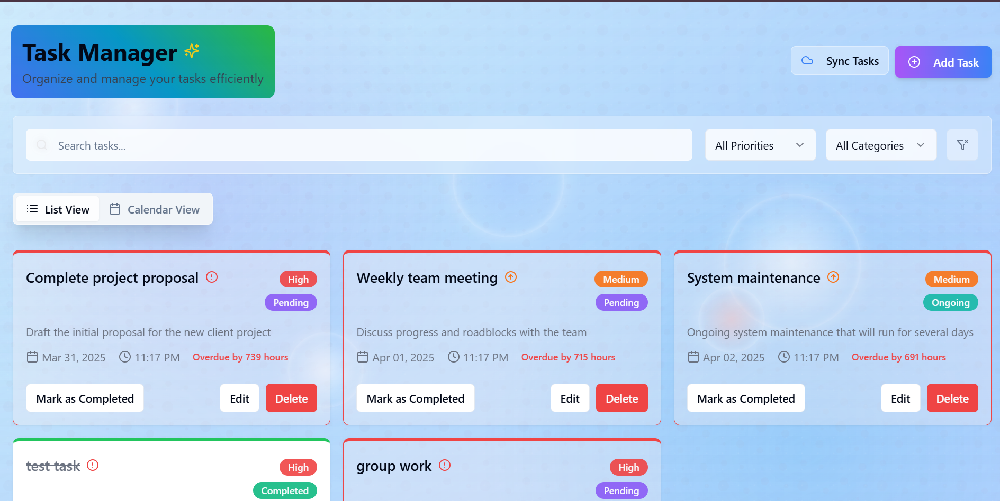
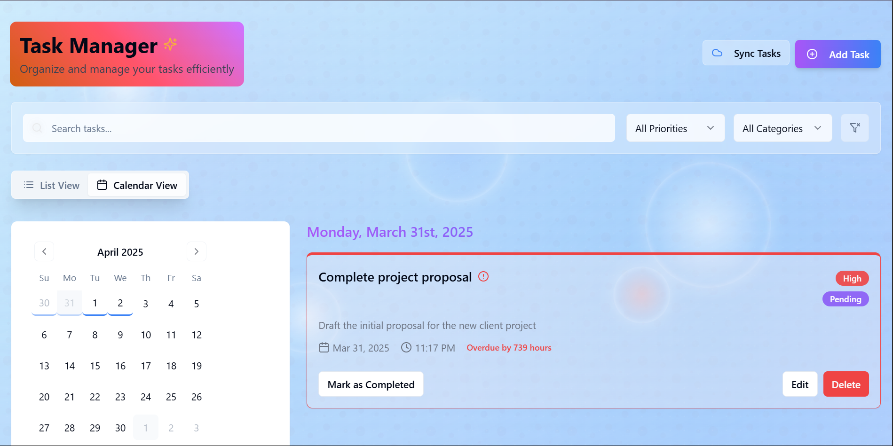
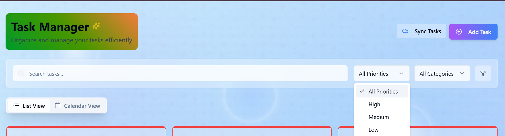
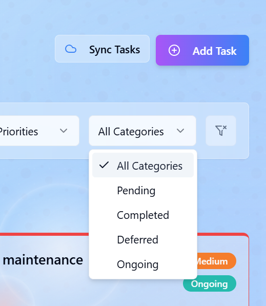

## App info
This is a simple task management web application built using TypeScript, JavaScript, HTML, and CSS.
Tasks are organized into different categories: Pending, Completed, Deferred, and Ongoing. Each task also has an assigned priority level, ranging from Low to High.

Key Features:

-Real-time notifications when a scheduled task is due.

-Countdown timer available in hours for upcoming tasks.

Feel free to explore and test the project yourself. Enjoy!
### Dashboard View


### Calendar view


### Priorities


### Categories



## How you can edit this code:
You can directly download the zip here and find all codes and componenrs.

**Use your preferred IDE**
If you want to work locally using your own IDE, you can clone this repo and push changes.
The only requirement is having Node.js & npm installed - [install with nvm](https://github.com/nvm-sh/nvm#installing-and-updating)

## To run the app locally, follow the following steps:

Step 1: Clone the repository using the project's Git URL.

```bash
git clone https://github.com/h-hiram/Task-Management-App
```

Step 2: Navigate to the project directory.
```bash
cd Task-Management-App
```
```bash
cd Task-Management-App
```

Step 3: Install the necessary dependencies.

```bash 
npm install
```

Step 4: Start the development server with auto-reloading and an instant preview.

```bash
npm run dev
```

Step 5: Access the app in your browser through:

```bash
http://localhost:8080
```

## This project is built with:

- Vite
- TypeScript
- React
- Tailwind CSS
- Capacitor (for mobile apps)

